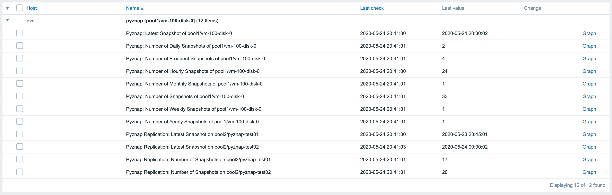
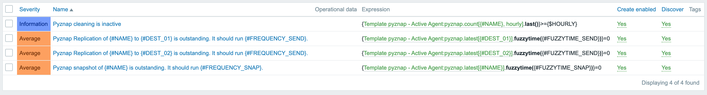

# Zabbix Template: https://github.com/yboetz/pyznap

Template for monitoring ZFS snapshots by [yboetz/pyznap](https://github.com/yboetz/pyznap). It will:

* Show the number of snapshots
* Show timestamps of the latest snapshot & replication
* Alerts when a snapshot is outstanding
* Alerts when a cleaning is inactive

### How to use

1. Download the scripts to `/etc/zabbix/scripts`
2. Copy the User Parameter file to `/etc/zabbix/zabbix_agentd.d`
3. Restart Zabbix-Agent
4. Upload the template to Zabbix Server
5. Link the template to a host

### Screenshots

